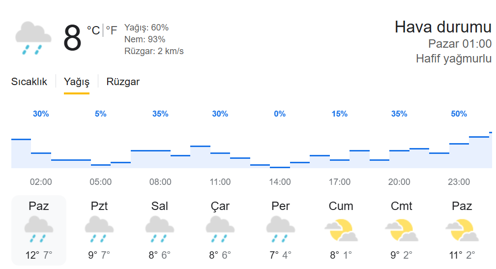

# Weather Application

This project is a simple weather application built using **Flask** and **JavaScript**. Users can enter a city name to view the weather data for that city. The application visualizes data such as temperature, humidity, wind speed, and precipitation probability through dynamic charts.



## Features

- Users can enter a city name to retrieve weather information.
- Weather data is fetched using the **OpenWeatherMap API**.
- Dynamic charts visualize temperature, precipitation probability, and wind speed.
- **JavaScript** and **Chart.js** are used to convert the data into charts.

## Requirements

This project uses the following libraries:

- **Flask**: To build the web application.
- **Requests**: To make HTTP requests to the OpenWeatherMap API.
- **Chart.js**: To create dynamic charts.

### Prerequisites

- Python and `pip` should be installed on your system.
- **OpenWeatherMap API** key is required.

### 1. Ensure that Python and pip are installed

You can check if Python is installed on your system by running the following command:

```bash
python --version

